+++
title = "CloudFormation Events Timeline view in a Gantt Chart"
date = "2024-10-15"

[taxonomies]
tags = ["github", "aws", "cloudformation"]

[extra]
author = "George Alton"
+++

AWS released a CloudFormation Timeline to the AWS Console. Presenting the Stack
Events like this helps us comprehend the reasons why a Stack takes time to
update, and visualize causes of failure.

GitHub Actions runs my deployments, code that gets merged into main runs in 
GitHub Actions. That's where I'm looking at when I click merge Pull Request. 
When there is an error debugging is 

Going from GitHub Acions to the AWS Console. 

Give me the Stack Name

```python
from argparse import ArgumentParser

parser = ArgumentParser()
parser.add_argument("stack", help="Name of CloudFormation Stack")
args = parser.parse_args()
stack_name = args.stack
```

Get the Stack Events

```python
from boto3 import Session
from datetime import datetime

session = Session()
cloudformation = session.client("cloudformation")
paginator = cloudformation.get_paginator("describe_stack_events")


def get_deployment_events(stack_name: str):
    for page in paginator.paginate(StackName=stack_name):
        for stack_event in page["StackEvents"]:
            if stack_event.get("ResourceStatusReason") == "User Initiated":
                yield stack_event
                return
            yield stack_event
```

Group Events By Resource

```python
from collections import defaultdict

events_by_resource = defaultdict(list)
for event in get_deployment_events(stack_name):
    events_by_resource[event["LogicalResourceId"]].append(event)
```

Build a Gantt Chart

```python

MERMAID_GANTT = f"""
gantt
    title Stack {stack_name} Deployment
    dateFormat x
    axisFormat %S.%L
"""

for section_name, events in events_by_resource.items():
    section = f"\n    section {section_name} [{events[0]["ResourceType"]}]\n"
    MERMAID_GANTT += section

    for index, event in enumerate(events):
        status = event["ResourceStatus"]
        earlier_events = events[index+1:]

        if status.rpartition("_")[-1] not in {"FAILED", "COMPLETE"}:
            continue

        init_status = "_".join((status.rpartition("_")[0], "IN_PROGRESS"))
        end_time = int(event["Timestamp"].timestamp() * 1000)

        # try to find init time
        init_time = end_time  # use end_time as default if can't find start
        # there may be more than 1 event with the init_status
        # we naively at the moment select the earliest
        candidates = [candidate for candidate in earlier_events if candidate["ResourceStatus"] == init_status]
        if candidates:
            earliest_candidate = candidates[-1]
            init_time = int(earlist_candidate["Timestamp"].timestamp() * 1000)

        is_failure = status.endswith("FAILED")
        label = "crit" if is_failure else "done"
        MERMAID_GANTT += f"    {status} :{label}, {init_time}, {end_time}\n"


def format_github(mermaid_diagram_data):
    return f"```mermaid\n{mermaid_diagram_data}\n```"


print(format_github(MERMAID_GANTT))
```
And the output

```mermaid
gantt
    title Stack Example Deployment
    dateFormat x
    axisFormat %S.%L

    section Example [AWS::CloudFormation::Stack]
    CREATE_COMPLETE :done, 1732724310778, 1732724331438

    section RoleB [AWS::IAM::Role]
    CREATE_COMPLETE :done, 1732724312879, 1732724330031

    section RoleA [AWS::IAM::Role]
    CREATE_COMPLETE :done, 1732724312847, 1732724329912

    section PolicyA [AWS::IAM::ManagedPolicy]
    CREATE_COMPLETE :done, 1732724312866, 1732724329101
```


